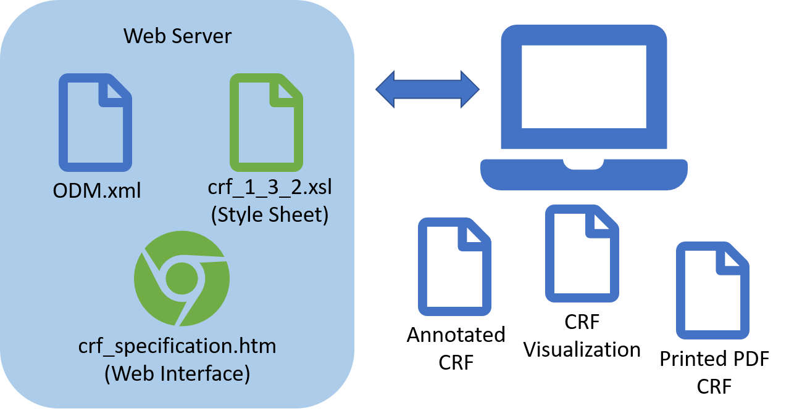
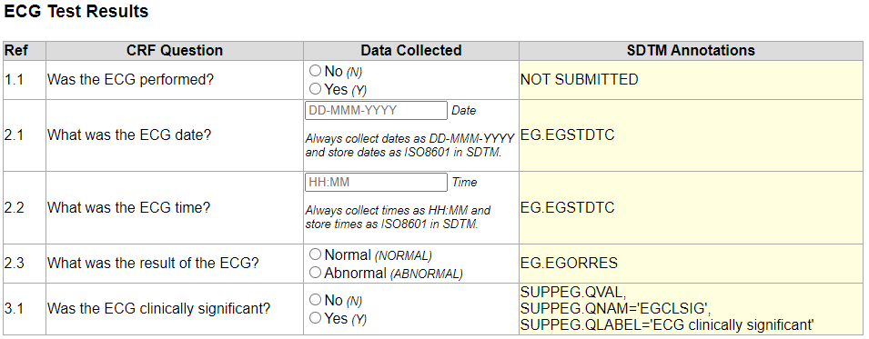

# Table of Contents
* [About The Project](#About_The_Project)
  * [Built With](#Built_With)
  * [Versions](#Versions)
* [Getting_Started](#Getting_Started)
  * [Installation](#Installation)
  * [Prerequisites](#Prerequisites)
* [Usage](#Usage)
  * [crf_1_3_2.xsl](#crf_1_3_2_xsl)
  * [crf_specification.html](#crf_specification_html)
    * [Modifications](#Modifications)
* [Roadmap](#Roadmap)
* [License](#License)
* [Contact](#Contact)
* [Acknowledgements](#Acknowledgements)

# About The Project <a name="About_The_Project"/>
This project is to exploit the CDISC ODM standard as a one source of truth definition of a CRF specification, allowing

* Visual inspection of a CRF design directly from an ODM-xml file
* Documentation of the link between the CRF questions and the collected data points through SDTM annotations
* The ODM-xml file to be used as an import specification to eCRF software

All in one blow. The solution is a fairly simple XML translating style sheet allowing the ODM-xml file to be both human and machine readable without changing the content.

## Built With <a name="Built_With"/>
The main component is a XSLT translating style sheet applied to an ODM-xml file of your own. The result is a webpage displaying the CRF pages, questions, and SDTM annotations. The web page page can be printed from the browser, should anyone still live in a paper based world. The HTML file used to link the XML file to the XSL style sheet will run in modern browsers, NOT Internet Explorer.

## Versions <a name="Versions"/>
This project covers ODM version 1.3.2 only. Other version of ODM-xml files are not expected to work. ODM version 1.0.0 and ODM version 1.1.0 files have been tested, and they don't work.

# Getting Started <a name="Getting_Started"/>
Try a [live version](http://try2.info/odm2crf/odm2crf.html) to test your own ODM file, or my supplied [examples](/example).

Download the files from the [xsl_files](/xsl_files) folder and place it on your web server.

## Installation <a name="Installation"/>
The XSL Style Sheet can work by itself together with any XSLT processor to render the CRF from an ODM-XML file. However, the HTML file requires that the components

* XSL Style sheet `crf_1_3_2.xsl`
* HTML file `crf_specification.html`
* ODM-xml file `odm-file-of-your-choise.xml`

are located __ON A WEB SERVER__ in the same folder. It will not run from a file folder without a web server. The HTML file has some hardcoding of file names for ODM-xml file and the XSL Style Sheet file. These can be changed by editing the HTML file. The HTML file has an initial prompt for the name of the ODM-xml file, which can easily be replaced with a hardcoding of the file name, and subsequently removal of the prompt.

# Usage <a name="Usage"/>
## crf_1_3_2.xsl <a name="crf_1_3_2_xsl"/>
This document is a piece of XSL-xml to display a valid CDISC ODM-xml file as an SDTM annotated CRF in a browser. The selected technology is supported in any modern browser (not Internet Explorer). The resulting web page can toggle SDTM annotations on and off, enabling printing of the CRF with and without these parts. The document can be used as a stand-alone XSL style sheet when linked to a valid ODM-xml file. This way of displaying a CRF book with SDTM annotaitons is intended to serve as a visual representation of the ODM-xml file itself.

The intended procedure is to refresh the ODM-xml file on your server as it's development progresses, and then refresh the **crf_specification.html** file in the browser to see the rendition. Please notice in the image below that the CRF rendition contains a title page, a live table of contents (links preserved when printed as PDF), a visit matrix if visits are defined in the ODM-xml file, and a separate table per CRF form. When printing, page breaks separating each page and table exists.

The CRF rendition consists of one table for each form in the CRF identified as **FormDef** tags.
* The first column is any guidance text or instructions for the particular question identified by **Description/TranslatedText** tag within the **ItemDef** tag.
* The second column is a sequence number constructed entirely form the **OrderNumber** attributes at different tags in the ODM-xml file. The number serves as a human reference when discussing and reviewing CRF content, as well as keeping track of the sorting of CRF elements.
* The third column is the question from the CRF forms identified as **Question/TranslatedText** tags.
* The fourth column is the answer to the question distinguised by **DataType** attributes. Each data type is displayed as a browser specific interpretation of an HTML <input> tag of the corresponding type. As no indication of multiple selects exist in the ODM definition, this data type is extracted from the text itself.
* The fifth column is the SDTM annotation identified as **@SDSVarName** attributes. Additional information is added from **Alias/@Name** attributes having a **@Context='SDTM'** attribut as SDTM annotation marker.

## crf_specification.html <a name="crf_specification_html"/>
This document is a piece of HTML code containing only JavaScript to link a valid XSL Translating Style Sheet to a valid ODM-xml file without putting the style sheet link into the XML file itself. All XML and XSL files are supported, although some file names are hard coded. The resulting web page can serve as a CRF specification interpreting a valid ODM-xml file. This file needs to be placed on a web server in the same folder as your ODM-xml file and the **crf_1_3_2.xsl** XSL Translating Style Sheet. When clicking this file, the browser will perform the transformation of the XML file according to the programming in the XSL file. If the transformation is performed using a stand-alone XSL engine that is not a browser, this file is not needed. I have tested that SAS PROC XSL can perform such a transformation and produce a simmilar result as the **crf_specification.html** file.

#### Modifications <a name="Modifications"/>
The file **crf_specification.html** contains a HTML prompt to ask for the name of the ODM-xml file to be processed. If this is to changed, you may do the following:
* If the default name is to be changed, simply replace the name of the ODM-xml file. Likewise the name of the XSL file can be changed as they both are simple hard codings. Furthermore, either file name can be prepended with folder paths referring to locations on whichever server hosts the files.
* If the prompt is to be removed, simply replace the prompt function call in the parameter to the **transform()** function with a text constant containing the name. You may go all the way and remove the parameter to **transform()** all together, leaving a text constant as the parameter to the first call to the **loadDoc()** function.

Please notice that file names may be case sensitive on your system too.

# Roadmap <a name="Roadmap"/>
It is my hope that this way of displaying annotations will catch on and eventually become wide spread throughout the pharma industry.

This is very much a work in progress, but these parts are curently under consideration
* Displaying editorial (and other) remarks as part of the CRF, pending a uniform way to include notes in the ODM-xml file.

# License <a name="License"/>
Distributed under the MIT License. See [LICENSE](https://github.com/jmangori/CDISC-ODM-and-Define-XML-tools/blob/master/LICENSE) for more information.

# Contact <a name="Contact"/>
Jørgen Mangor Iversen [jmi@try2.info](mailto:jmi@try2.info)

[My web page in danish](http://www.try2.info) unrelated to this project.

[My LinkedIn profile](https://www.linkedin.com/in/jørgen-iversen-ab5908b/)

# Acknowledgements <a name="Acknowledgements"/>
Thanks to [Martin Honnen](https://github.com/martin-honnen/martin-honnen.github.io/blob/master/xslt/arcor-archive/2016/test2016081501.html) for code to execute asynchronous `XSLTProcessor()` clientside in the browser.

This software is made public with the explicit permission from LEO Pharma A/S
